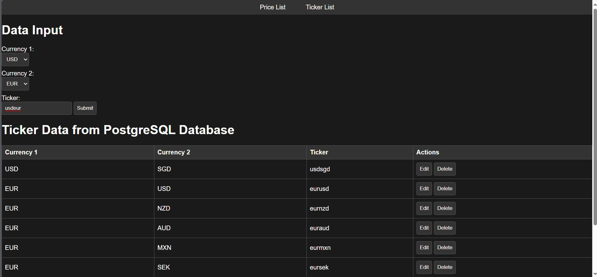
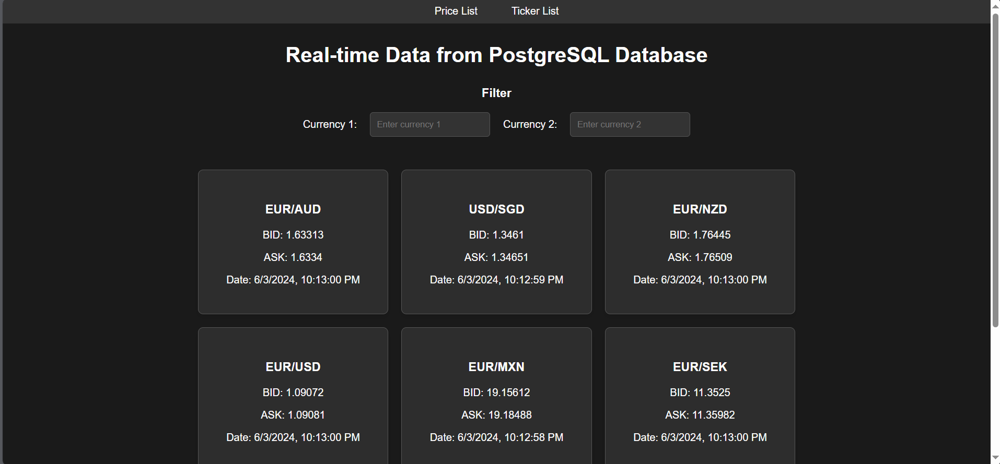

# Web Dashboard for Real-Time FX Data Retrieval

This project aims to create a web dashboard capable of retrieving real-time Foreign Exchange (FX) data using a WebSocket. The server is implemented with Flask, and the WebSocket source utilizes `wss://api.tiingo.com/fx`.

## Table of Contents

- [Installation](#installation)
- [Usage](#usage)
- [Features](#features)
- [Contributing](#contributing)
- [License](#license)
- [Contact](#contact)

## Installation

Step-by-step instructions on how to get your project up and running.

1. Clone the repository:
```sh
   git clone https://github.com/aim-Tokinyem/Websocket-MarketData.git
```

2. Create a virtual environment:
```sh
   python -m venv venv
```
3. Activate the virtual environment:
```sh
   venv\Scripts\activate.bat
```
4. Install the required packages:
```sh
   pip install -r requirements.txt
```
5. Create .env file
```sh
   WEB_SOCKET_URL=wss://api.tiingo.com/fx
   WEB_SOCKET_KEY=

   DB_NAME=
   DB_USERNAME=
   DB_PASSWORD=
   DB_HOST=
   DB_PORT=

   LOG_DIR=
```

## Usage

Detailed instructions and examples for using the Websocket-MarketData Project. After completing the installation steps, you can start the project locally.

### Running the server
```sh
   python -m server.main
```

### Running the Websocket

```sh
   python -m websockets.main
```

### Accessing the Website
#### Ticker List
1. Open your browser and navigate to http://localhost:5000/ticker_list.
2. To add ticker data, 
   - Select Currency 1 & Currency 2, 
   - Enter the ticker (e.g., USD, SGD, usdsgd). 
   - Submit the form.
3. The data will be saved in the table. Websockets will read the table and request data based on the entries.
4. You can update or delete entries in the table as needed.



#### Price List
1. Open your browser and navigate to http://localhost:5000/price_list.
2. The dashboard will display FX values (Bid, Ask, Date) based on the Ticker List table.
3. You can filter the values by selecting Currency 1 or Currency 2.



## Features

- Real-time FX data retrieval
- Web dashboard to display FX information
- Automaticly create Log to track

## License

This project is licensed under the [MIT License](LICENSE).

## Contact
For any questions or suggestions, feel free to reach out.


